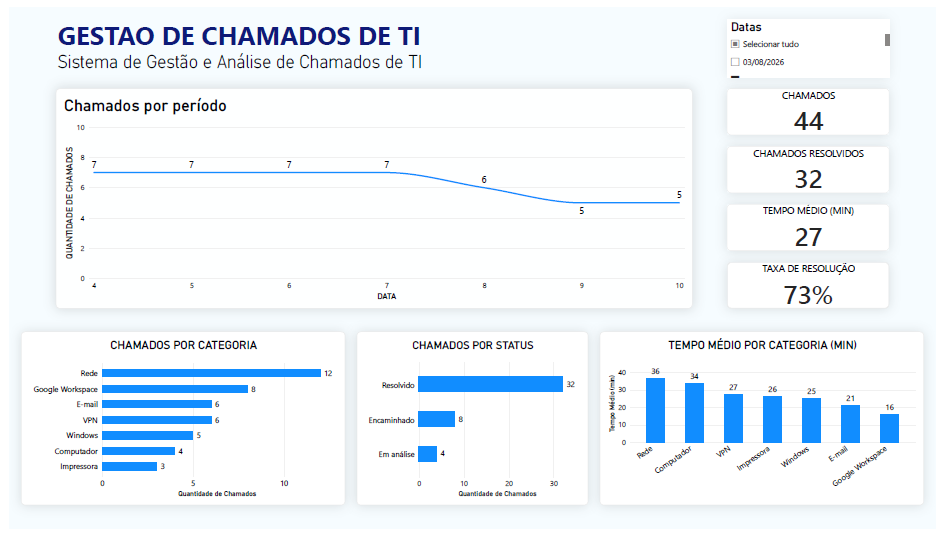

# Sistema de Gestão e Análise de Chamados de TI

> Simulação de um ambiente de Service Desk N1 para coleta, organização e análise de chamados de TI.

## 📌 Sobre o projeto

Este projeto simula um fluxo de gestão de chamados de TI, desde o registro de uma solicitação pelo usuário até a análise dos dados por meio de indicadores e dashboards.

O objetivo é demonstrar, de forma prática, a aplicação de conceitos relacionados a Service Desk, organização de dados, gestão de chamados e análise de informações.

## 🎯 Objetivos

- Simular o registro estruturado de chamados de suporte;
- Organizar e centralizar os dados coletados;
- Preparar os dados para análise;
- Criar indicadores de atendimento;
- Visualizar padrões e informações relevantes sobre os chamados;
- Demonstrar um fluxo integrado utilizando ferramentas acessíveis.

## 🔄 Fluxo do projeto

O projeto segue o seguinte fluxo:

**Google Forms → Google Sheets → Excel → Power BI**

### 1. Google Forms
Formulário utilizado para registrar as solicitações de suporte técnico.

### 2. Google Sheets
As respostas são armazenadas e organizadas automaticamente em uma base de dados.

### 3. Microsoft Excel
A base é exportada em formato XLSX e utilizada para organização e preparação dos dados.

### 4. Power BI
Os dados são importados para o Power BI, onde são construídos indicadores e visualizações para análise dos chamados.

## 🛠️ Tecnologias utilizadas

- Google Forms
- Google Sheets
- Microsoft Excel
- Power BI

## 📊 Dashboard

O dashboard apresenta indicadores relacionados ao atendimento dos chamados, incluindo:

- Quantidade de chamados;
- Chamados resolvidos;
- Percentual de resolução;
- Tempo médio de atendimento;
- Chamados por categoria;
- Chamados por status;
- Evolução dos chamados ao longo do período;
- Tempo médio de atendimento por categoria.

## 📋 Estrutura dos dados

A base utilizada no projeto contém informações fictícias estruturadas para representar um ambiente de Service Desk N1.

Entre os principais campos estão:

- ID do chamado;
- Categoria;
- Problema;
- Prioridade;
- Status;
- Tempo de atendimento;
- Data;
- Hora de abertura;
- Hora de encerramento;
- Nível de atendimento;
- Subcategoria.

> **Observação:** todos os dados utilizados neste projeto são fictícios e foram criados exclusivamente para fins educacionais e de demonstração.

## 🎥 Demonstração

A demonstração apresenta o fluxo completo do projeto, desde o preenchimento do formulário até a geração do dashboard no Power BI.

**[▶️ Assistir à demonstração do projeto](https://youtu.be/4k2yvsH1nqM?si=yXEMjwXxtfVfLlEu)**

## 📁 Arquivos do projeto

- [📊 Base de dados em Excel](Base_Ficticia_Service_Desk.xlsx) — base fictícia utilizada para simular os chamados de Service Desk N1.
- [📄 Dashboard em PDF](dashboard-power-bi.pdf) — versão em PDF do dashboard desenvolvido no Power BI.
- [📝 Formulário de abertura de chamado](formulario-abertura-chamado.png) — captura do formulário utilizado para registro das solicitações.

## 🧠 Competências aplicadas

- Gestão e organização de chamados;
- Conceitos de Service Desk N1;
- Organização e tratamento de dados;
- Criação de indicadores;
- Análise de dados;
- Construção de dashboards;
- Excel;
- Power BI;
- Google Workspace.

## 💡 Aprendizados

O desenvolvimento deste projeto permitiu compreender, na prática, como dados provenientes de solicitações de suporte podem ser estruturados e transformados em informações úteis para acompanhamento do atendimento.

O projeto também reforçou a importância da organização dos registros, padronização das informações e utilização de indicadores para apoiar a análise de processos de suporte.

## 👨‍💻 Autor

**Ageu Oliveira**

Estudante de Tecnologia da Informação | Suporte de TI | Redes | Automação

[GitHub](https://github.com/AgeuOliveira)
